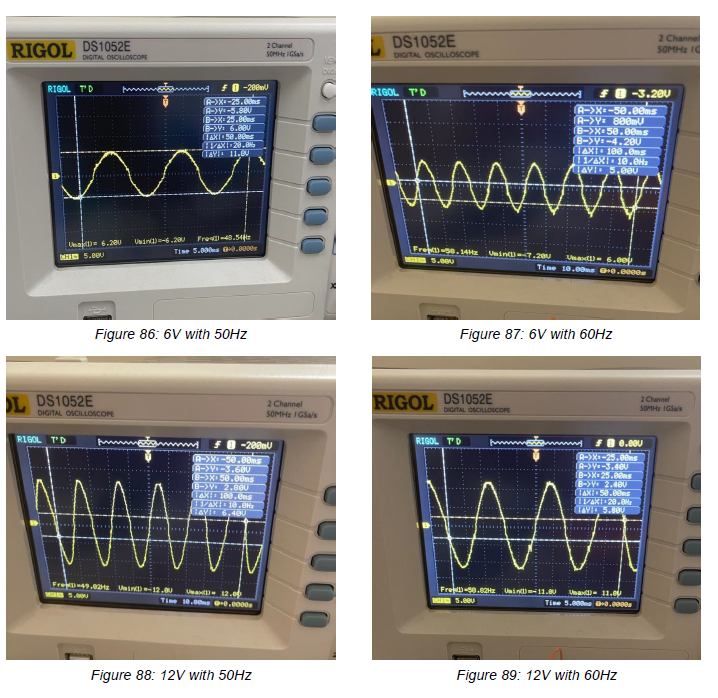
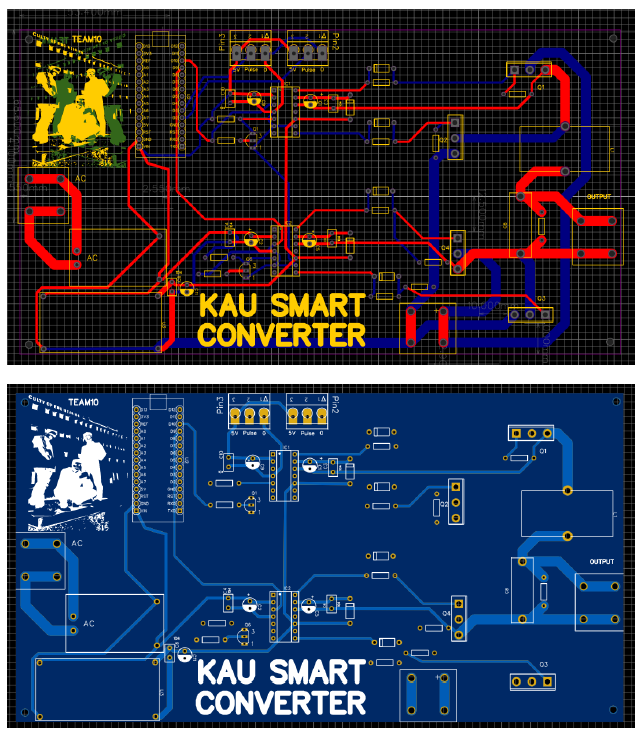
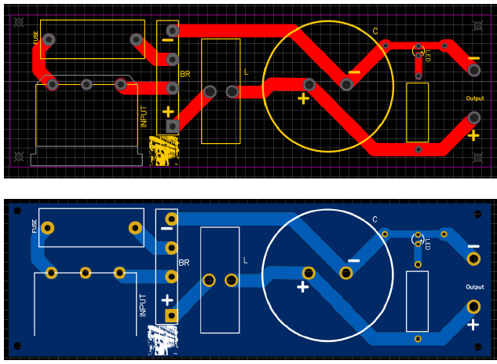

# DC_AC_Converter
_____  

This project was developed as a senior design project by Electrical and Computer Engineering students at KAU, Jeddah, KSA in Fall 2021.  

## Introduction
_____  

This product is a universal DC-AC converter capable of providing pure sine 220V or 110 V AC at either 50 or 60 Hz frequency. 

## The Team
Ibrahim Bafaqeer (Bafaqeeribra@gmail.com)  
Ammar Alqrni (Ammaralqrni16@gmail.com)  
Khalid Alsubhi (Khalidalsubhi1@gmail.com)  

## Acknowledgement
The project was finished with technical and logistics help from Robotics Lab at Center Of Excellence in Intelligent Engineering Systems, KAU.

## Project in Action  
https://www.youtube.com/watch?v=j4WqhUz65uQ&t=1s

